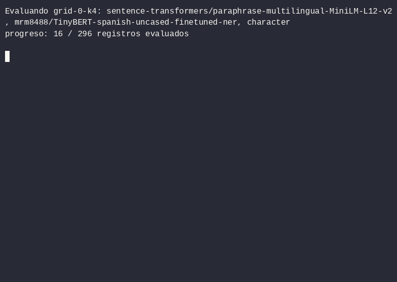
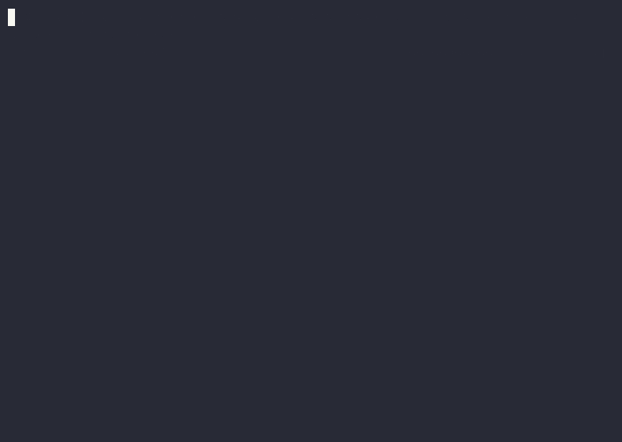
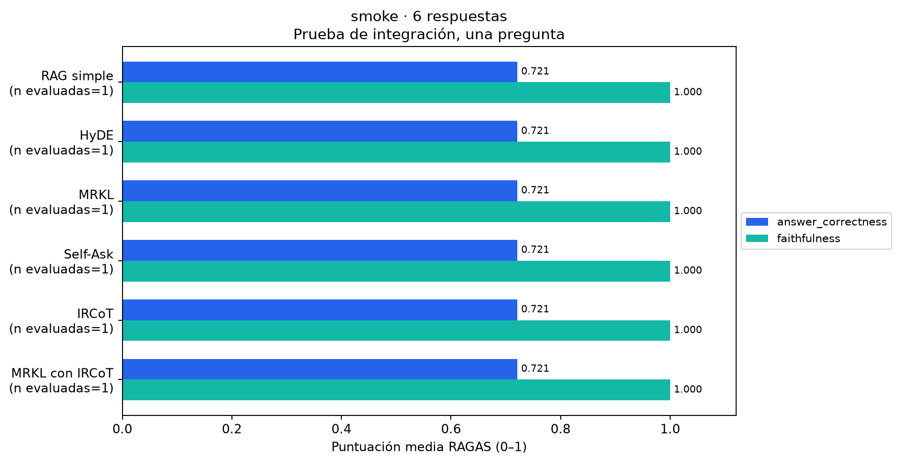

# Taller 3 — Comparación de sistemas RAG

Laboratorio sobre los diez documentos de Lumina Robotics. Código modular en
`src/taller_3`, configuración en `config.json` y resultados en `outputs/`.
La ejecución es completamente en Python y este README es el informe del laboratorio.
El generador configurado es **Gemma 4 E4B**, instalado localmente
como `gemma4:e4b` en Ollama.

## Preguntas de evaluación

[questions.json](questions.json) contiene ocho preguntas representativas creadas
a partir del corpus: dos factuales, dos temporales, dos multihop y dos comparativas.
Cada entrada incluye `id`, `question`, `reference`, `type` y `sources` para auditar
la respuesta de referencia. En conjunto cubren los diez documentos. Las fuentes
anotadas son solo para auditoría: no se entregan al enrutador ni al generador.

Estas preguntas **no son las preguntas originales de clase**, que no se incluyeron
en el repositorio; su procedencia se registra en `config.json`. El experimento
puede ejecutarse con este conjunto. Si se reciben las preguntas originales,
deben sustituirse junto con sus referencias y actualizarse `question_provenance`.
Las funciones de IRCoT se implementan a partir de la rúbrica; falta contrastar
sus firmas y topes específicos con el código de clase original.

## Ejecución

```bash
uv sync --locked
ollama serve                       # si el servidor no está activo
uv run taller-3 run                # ejecuta el laboratorio y actualiza el informe
# Equivalente como módulo Python:
uv run python -m taller_3
```

Se requiere conexión inicial a Hugging Face para descargar embeddings y
tokenizadores. El LLM se ejecuta localmente; no se necesitan claves de APIs de pago.
`uv.lock` fija dependencias y `hf_revisions` fija las revisiones de Hugging Face.
La caché local se guarda en `.cache/`. Para verificar las invariantes sin inferencia:
`uv run pytest` y `uv run ruff check src tests`.

## Probar una pregunta

El modo de pensamiento nativo de Gemma está activado con `"think": true` en
`config.json`, para todas las llamadas de los seis sistemas. `num_predict: 4096`
da espacio al pensamiento y la respuesta; una generación truncada sigue siendo
un error explícito. Para desactivarlo, cambie `think` a `false`.
El juez RAGAS mantiene `think=False`, separado del generador.
Solo la respuesta final se pasa a los siguientes pasos y al juez. Los registros
indican si Ollama devolvió pensamiento, sin guardar su texto. Se contabilizan los
tokens de salida reportados por Ollama y el tiempo completo de cada llamada.
Los resultados anteriores se obtuvieron sin pensamiento; el cambio de configuración
genera una firma diferente para la próxima grilla.

```bash
uv run python -m taller_3 ask "¿Cuál es la autonomía del LR-200?"
uv run python -m taller_3 ask "¿Qué hago si persiste el error E07?" --system "MRKL con IRCoT"
uv run python -m taller_3 ask "¿Cuál es la garantía del LR-200?" --embedding "BAAI/bge-m3" --top-k 4
```

`ask` usa Gemma y, por defecto, el primer embedding, tokenizador, chunker y top-k
de `config.json` (no presupone una configuración ganadora). Muestra la respuesta y
el costo, y guarda fuentes y trazas en `outputs/queries/`. No requiere respuesta
de referencia, no ejecuta RAGAS ni modifica los resultados de la grilla.

## Comparar thinking activado y desactivado

```bash
uv run python -m taller_3 compare-thinking
```

Ejecuta ocho pares de respuestas de RAG simple con mDenseOn, TinyBERT,
fragmentación por caracteres y top-k=4. Ambos modos usan el mismo presupuesto
de 4096 tokens, temperatura, semilla, corpus y juez RAGAS sin thinking.
Se alterna el orden on/off por pregunta y se excluye el calentamiento del modelo.
La colección es una candidata del ensayo de recuperación, no una ganadora RAGAS.

Guarda manifiesto, respuestas, métricas, deltas pareados, informe y figuras en
`outputs/thinking-<firma>/`; `outputs/latest-thinking.json` indica la ejecución.
Los resultados se reanudan por registro. No se reutilizan las pruebas históricas
con un presupuesto diferente. La opción `--systems` permite incluir otros sistemas:

```bash
uv run python -m taller_3 compare-thinking --systems "RAG simple" "IRCoT" "MRKL con IRCoT"
```

Para RAG simple se verifica que la evidencia recuperada sea idéntica en ambos modos.
En sistemas con pasos intermedios, thinking puede modificar también las búsquedas;
su comparación mide el efecto en el sistema completo.

## Gráficos de resultados

```bash
uv run python -m taller_3 plots
```

Genera figuras PNG y SVG sin volver a llamar al LLM. La [galería de resultados](outputs/plots/README.md)
incluye calidad RAGAS, tokens de entrada/salida, latencia, llamadas y correctness
frente a tokens, además de recall de recuperación por embedding y pregunta.
Las consultas manuales solo muestran costos, porque no tienen evaluación RAGAS.
Las pruebas de integración, los experimentos parciales y las consultas se grafican
por separado. Las figuras indican su alcance y número de mediciones disponibles.
El informe final también genera automáticamente las figuras de calidad y costo.

## Diseño experimental

La grilla cruza **4 embeddings × 2 tokenizadores × 2 chunkers × 2 top-k = 32
configuraciones**, cada una evaluada sobre las ocho preguntas con los diez archivos
indexados. Se selecciona el máximo de answer correctness medio de RAGAS;
el empate conserva el orden de la grilla. Esa colección y ese top-k se comparten
entre los seis sistemas. La respuesta de referencia se usa solo en evaluación.

| Variable | Valores |
|---|---|
| Embeddings | `sentence-transformers/paraphrase-multilingual-MiniLM-L12-v2`, `intfloat/multilingual-e5-small`, `lightonai/mDenseOn`, `BAAI/bge-m3` |
| Tokenizador de fragmentación | `mrm8488/TinyBERT-spanish-uncased-finetuned-ner`, `dccuchile/bert-base-spanish-wwm-cased` |
| Chunker | caracteres (480), semántico (similitud entre oraciones, umbral 0.65) |
| Presupuesto por fragmento | 96 tokens del tokenizador candidato; además se respeta el máximo del embedding |
| top-k | 2, 4 |
| Generador y juez | Gemma 4 E4B, temperatura 0, semilla 42 |
| IRCoT | máximo 4 oraciones y 8 fragmentos únicos |
| Self-Ask | máximo 3 subpreguntas secuenciales |

Se descargan únicamente los archivos de los tokenizadores candidatos, **no los
pesos de TinyBERT o BETO**. Un modelo pequeño no implica un vocabulario pequeño:
el objetivo aquí es reducir la descarga de tokenización. Estos tokenizadores son
un hiperparámetro de segmentación; cada embedding conserva su propio tokenizador
entrenado. Se preserva el texto original mediante offsets, incluidas tildes.
Los embeddings se ejecutan en CPU para dejar recursos al generador. E5 recibe
los prefijos `query:` y `passage:`; mDenseOn usa los prompts `query` y `document`
incluidos en su checkpoint; BGE-M3 usa embeddings densos sin prefijo. HyDE se codifica como pasaje con el mismo
embedding de la colección. La recuperación usa vectores normalizados y coseno.

En la descarga verificada, TinyBERT ocupa aproximadamente 276 KiB de archivos de
tokenización/configuración y BETO 748 KiB; ambos tienen 31 002 entradas. Los
embeddings MiniLM y E5-small descargados ocupan aproximadamente 458 y 471 MiB respectivamente.

## Prueba de embeddings adicionales

Se añadieron **mDenseOn** (307M parámetros) y **BGE-M3** de la lista propuesta,
con revisiones fijas en `hf_revisions`. mDenseOn requiere Sentence Transformers
5.x; `uv.lock` fija la versión verificada. Se mantienen MiniLM y E5-small como
baselines pequeños y el embedding del juez continúa siendo MiniLM.

```bash
uv sync --locked
uv run python scripts/trial_embeddings.py
```

Esta prueba guarda resultados en `outputs/embedding-trial/`, con los diez archivos
indexados, y actualiza automáticamente la galería al terminar. Las figuras en
`outputs/plots/embedding-trial/` muestran únicamente modelos con mediciones reales.
La comparación usa los diez archivos
indexados y las ocho preguntas, manteniendo el tokenizador TinyBERT, el chunker
por caracteres y top-k 2/4. `source_recall` es la fracción de archivos anotados en
`sources` que aparecen en los fragmentos recuperados; `source_hit` indica si se
recuperó al menos uno. Estas métricas se calculan por pregunta y luego se promedian.
Las fuentes anotadas solo se consultan después de recuperar. Como algunas fuentes
son redundantes, un recall menor que 1 no demuestra una respuesta incorrecta.
Tampoco distingue si se recuperó el fragmento correcto dentro del archivo.

Es una comparación de recuperación, no de answer correctness ni de faithfulness.
Los tiempos de consulta incluyen el embedding de la pregunta; son mediciones
únicas en CPU, sin repeticiones. Los límites nativos de cada embedding pueden
subdividir los fragmentos de forma distinta. La selección final de la colección
sigue dependiendo de la grilla RAGAS de 32 configuraciones (`uv run taller-3 run`).

La prueba de recuperación ya incluye los cuatro embeddings: 64 mediciones
(4 modelos × 8 preguntas × 2 valores de k). Con k=4, el recall medio de archivos
anotados fue **0.9375 para mDenseOn**, **0.8750 para BGE-M3**, 0.8125 para
E5-small y 0.7708 para MiniLM. Con k=2, E5-small obtuvo el mayor recall (0.7083).
Véanse el [informe de recuperación](outputs/embedding-trial/README.md) y los
[gráficos actualizados](outputs/plots/README.md). No son resultados de la grilla RAGAS.

## Sistemas

- **RAG simple:** una recuperación y el generador común `responder`.
- **HyDE:** genera un pasaje hipotético, recupera con su vector y responde usando
  únicamente los documentos reales recuperados.
- **MRKL:** el LLM selecciona archivos; la búsqueda filtra por metadata `source`.
- **Self-Ask:** genera una subpregunta, recupera y responde; esa respuesta orienta
  la siguiente subpregunta. La respuesta final se fundamenta en los documentos.
- **IRCoT:** alterna `razonar`, `recuperar` y `continuar_ircot`, respetando topes
  estrictos. Cada oración registra recuperaciones, adiciones y total acumulado.
- **MRKL con IRCoT:** aplica el enrutador antes de IRCoT y mantiene el filtro en
  todas las recuperaciones.

`core.errors` centraliza las excepciones en `outputs/errors.jsonl`. No se convierte
un fallo del juez en una puntuación cero ni se omiten preguntas de las medias.
Los registros se guardan antes de evaluar y permiten reanudar la evaluación.

## Medición y entregables

RAGAS 0.2.15 proporciona **AnswerCorrectness** (factualidad y similitud semántica)
y **Faithfulness** por pregunta. El embedding del juez se mantiene fijo durante
la búsqueda para no confundir un cambio de recuperación con un cambio de métrica.
La evaluación se ejecuta después de detener el reloj y cerrar el conteo de llamadas
del sistema: el juez no se incluye en el costo. Se cuentan todas las llamadas de
enrutamiento, hipótesis, subpreguntas, continuación y respuesta. Los tokens reales
de Gemma proceden de `prompt_eval_count` y `eval_count` de Ollama.

Cada ejecución guarda bajo `outputs/<firma>/`:

- `manifest.json`: configuración, preguntas, hashes del corpus y código, modelo y versiones.
- `collections/`: fragmentos con archivo de origen y ID estable.
- `grid.csv` y `best_config.json`: resultados de selección.
- `records/` y `results.json`: respuestas, contextos, llamadas, costos y trazas completas.
- `per_question.csv`, `by_type.csv`, `summary.csv`: tablas de desempeño y costo.
- `correctness_vs_tokens.png`: relación calidad–tokens, por pregunta y sistema.
- `failure_cases.json`: tres casos de menor puntuación de sistemas diferentes para análisis.
- `report.md`: informe con resultados reales, agregado también a este README.

`outputs/latest.json` indica la ejecución y si terminó. La tabla resumen se guarda
en `summary.csv` y se incorpora al informe. La latencia de cada registro es la medida original,
no el tiempo de lectura del caché. El indexado y la evaluación se excluyen del
tiempo de respuesta; no se estima costo monetario de la inferencia local.

## Límites

Ocho preguntas no permiten generalizar a producción. Elegir hiperparámetros y
comparar sistemas con las mismas preguntas introduce optimismo. El juez puede
equivocarse y comparte modelo con el generador. No hay repeticiones ni intervalos
de confianza. Cachés, calentamiento y hardware afectan la latencia. Los topes de
IRCoT limitan costo, pero también pueden impedir completar saltos necesarios.
Un score bajo no demuestra por sí solo un fallo del enrutador o propagación de
errores: se requiere verificar las trazas y las referencias antes de atribuir causas.

## Validación realizada

Pasaron tres pruebas: dos de invariantes de IRCoT/MRKL y una de serialización
de metadata de Ollama y reanudación del experimento; también pasó el lint.
Se verificó la generación de tablas, figura e informe con
registros reales en un directorio temporal. Se construyeron las ocho variantes
de colección, cada una con los diez archivos. Los seis sistemas ejecutaron una
pregunta técnica real con Gemma y ambas métricas RAGAS; sus registros y costos
están en [outputs/smoke/](outputs/smoke/README.md). Esa prueba **no equivale a la
comparación de las ocho preguntas de clase**, ni permite recomendar un sistema.
La versión final obtuvo métricas finitas para los seis sistemas. El log central
conserva también el error de inicialización RAGAS detectado y corregido durante
el desarrollo. El experimento completo con las ocho preguntas representativas
está en ejecución (`outputs/a118e92f6546/`, reanudable por registro); hasta que
termine, los resultados agregados disponibles corresponden a la prueba
de integración.

Se corrigió el fallo `Object of type datetime is not JSON serializable` al
serializar la respuesta de Ollama con `model_dump(mode="json")` antes de generar
la firma y guardar el manifiesto. La verificación con metadata real y la pregunta
`q1`, incluida su evaluación RAGAS, está en `outputs/runtime-check/`; no equivale
a una ejecución de la grilla completa.

## Grabaciones

Tres grabaciones de terminal documentan el laboratorio funcionando de verdad,
sin datos inventados. Cada una existe como `.cast` (asciinema, fuente exacta,
reproducible con scrollback real) y como `.gif` exportado para verse aquí mismo,
ambas en `recordings/`.

**Grilla del experimento en curso** — cambio real de configuración y conteo de
registros evaluados (`grid_progress.cast` / `.gif`):



**Consulta real con MRKL con IRCoT** — ejecución completa de
`uv run python -m taller_3 ask "¿Qué hago si persiste el error E07?" --system "MRKL con IRCoT"`,
con las esperas de inferencia comprimidas (`--idle-time-limit`) para no alargar
la reproducción (`ask_mrkl_ircot.cast` / `.gif`):



**Recorrido por figuras guardadas** en `outputs/plots/smoke/` y
`outputs/plots/embedding-trial/` (`plots_tour.cast`, renderizado en línea con
el protocolo de Kitty; el `.gif` se generó directamente de los PNG para no
depender de un terminal compatible):



Para reproducir los `.cast` originales:

```bash
uv tool install asciinema  # si no está instalado
asciinema play recordings/<archivo>.cast
```

## Fuentes

- [Gemma 4: ficha oficial](https://ai.google.dev/gemma/docs/core/model_card_4).
- [MiniLM multilingüe](https://huggingface.co/sentence-transformers/paraphrase-multilingual-MiniLM-L12-v2).
- [E5 multilingüe pequeño](https://huggingface.co/intfloat/multilingual-e5-small).
- [mDenseOn](https://huggingface.co/lightonai/mDenseOn).
- [BGE-M3](https://huggingface.co/BAAI/bge-m3).
- [TinyBERT español](https://huggingface.co/mrm8488/TinyBERT-spanish-uncased-finetuned-ner).
- [BETO cased](https://huggingface.co/dccuchile/bert-base-spanish-wwm-cased).
- [Métricas de RAGAS](https://docs.ragas.io/en/v0.2.14/references/metrics/).
