# Gráficos de resultados guardados

Cada carpeta corresponde a una ejecución separada. No se imputan métricas faltantes. Las medias usan solo las mediciones disponibles; n indica respuestas, no repeticiones. Las consultas manuales pueden ser preguntas diferentes y no constituyen una comparación controlada. También se exporta cada figura como SVG.

## 37bb0d643da5

37bb0d643da5 · 4 respuestas
Registros disponibles, no comparación completa

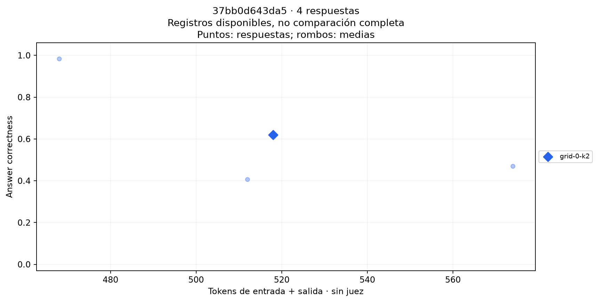

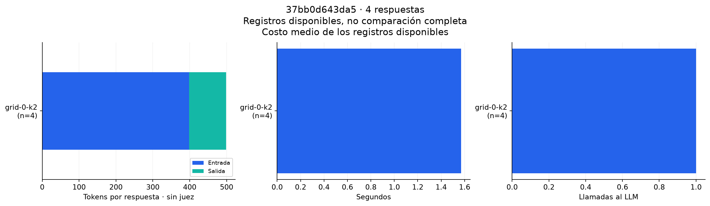

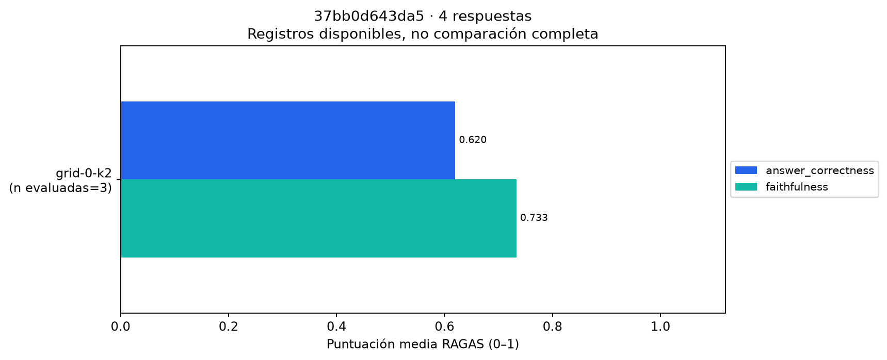

## embedding-trial

Embeddings · 4/4 modelos con registros · 64 mediciones

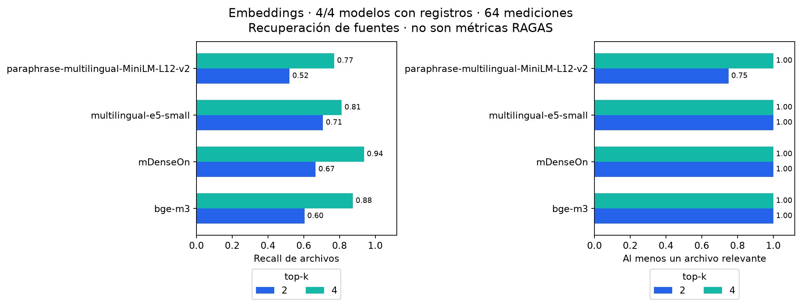

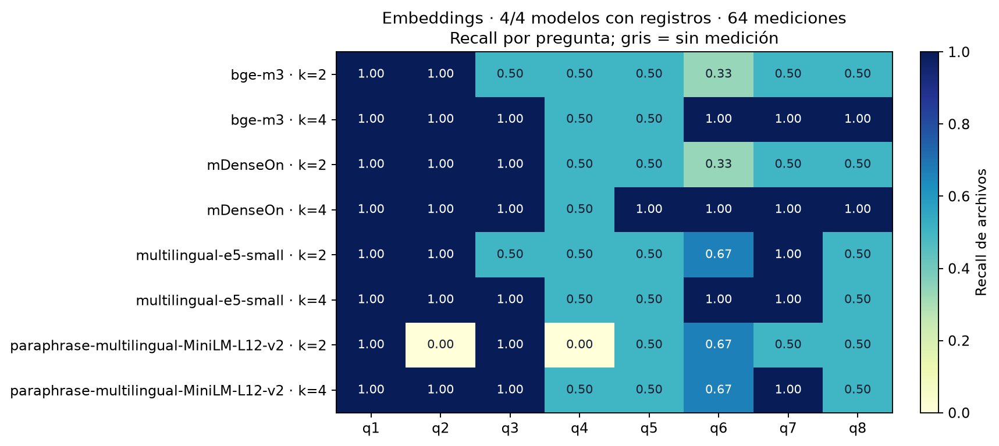

## queries

queries · 9 respuestas
Registros disponibles, no comparación completa

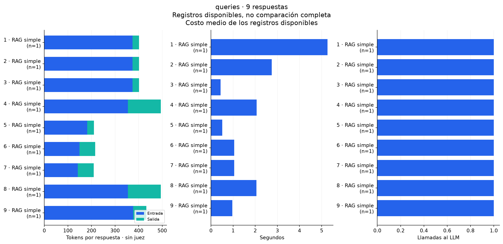

## runtime-check

runtime-check · 1 respuestas
Registros disponibles, no comparación completa

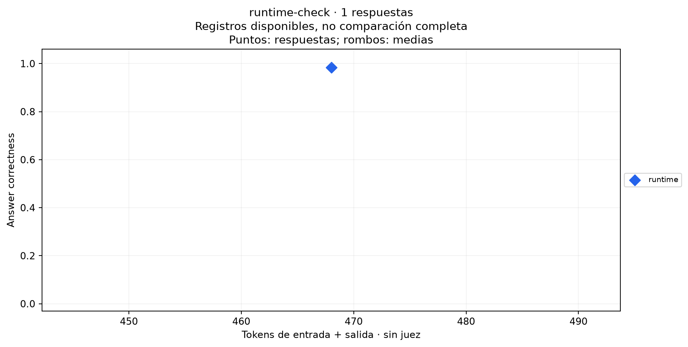

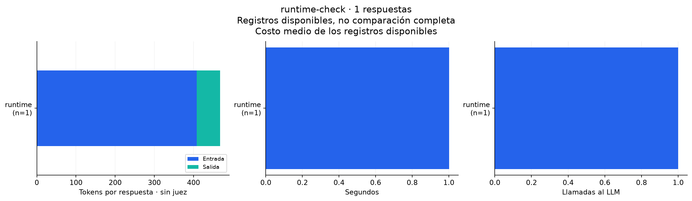

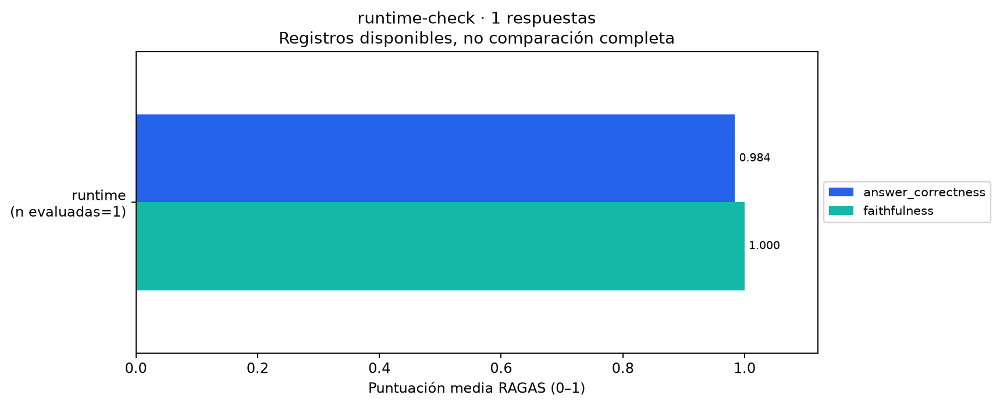

## smoke

smoke · 6 respuestas
Prueba de integración, una pregunta

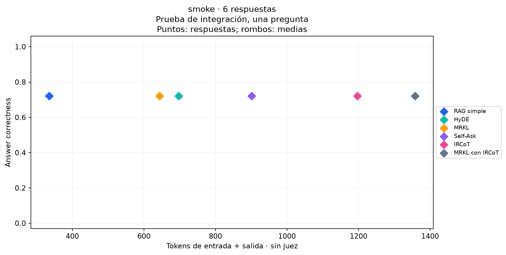

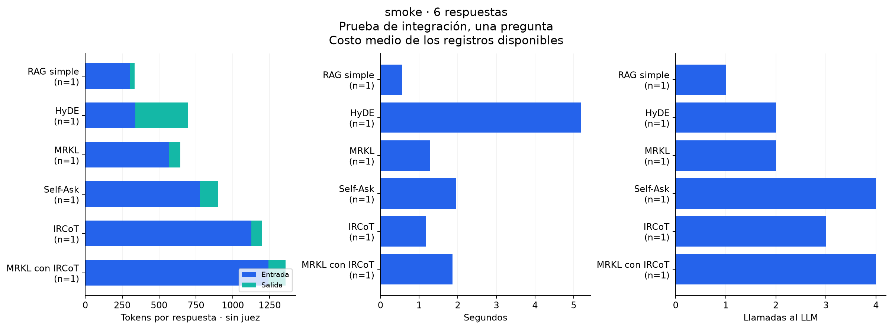

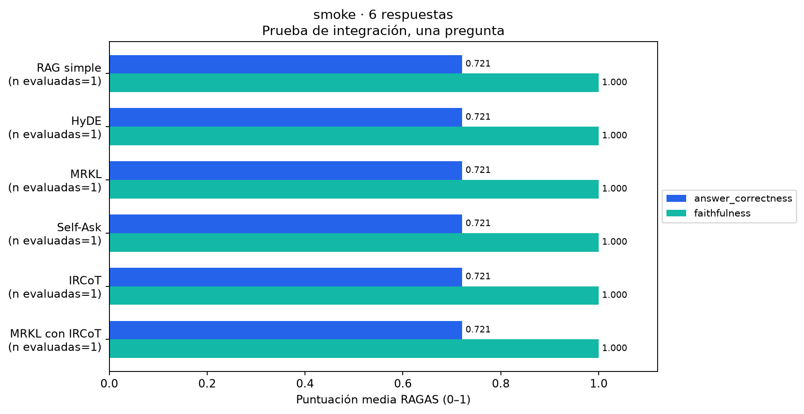