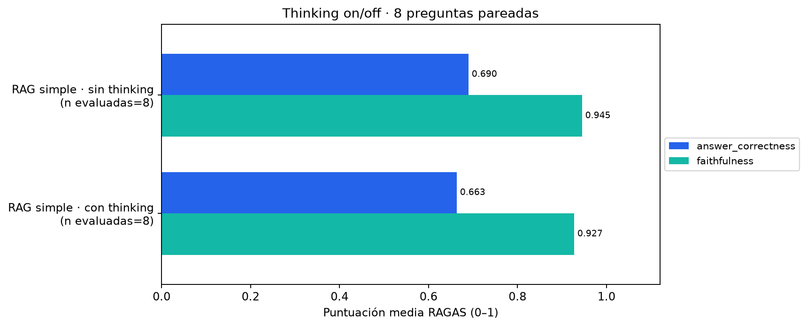
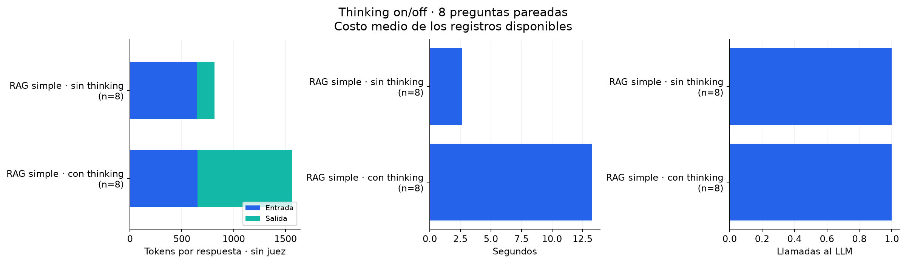
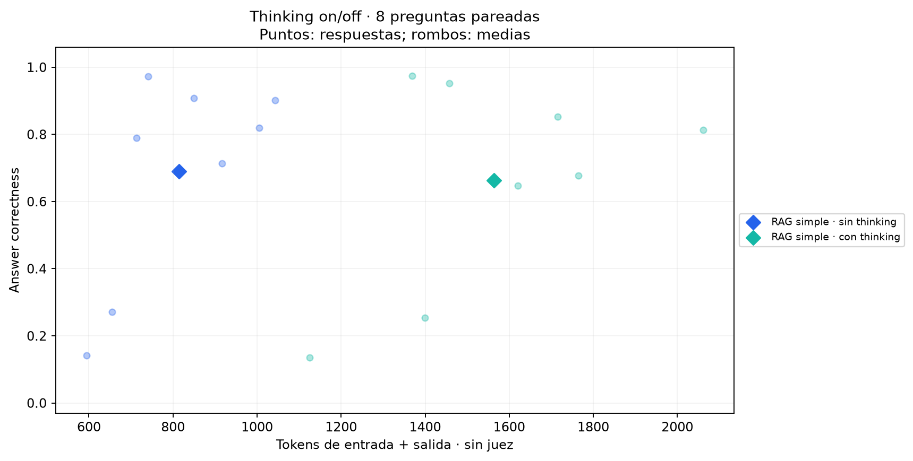

# Comparación de pensamiento nativo de Gemma

Colección fija: `{'embedding': 'lightonai/mDenseOn', 'tokenizer': 'mrm8488/TinyBERT-spanish-uncased-finetuned-ner', 'chunker': 'character', 'top_k': 4}`. Generador `gemma4:e4b`, temperatura 0,
semilla 42, num_predict 4096 en ambos modos. Juez sin thinking.
Orden alternado por pregunta; calentamiento excluido. Referencias visibles solo al juez.
Configuración candidata del ensayo de recuperación, no ganadora de la grilla RAGAS.

## Medias por pregunta

|                       |   answer_correctness |   faithfulness |   total_tokens |   llm_calls |   seconds |
|:----------------------|---------------------:|---------------:|---------------:|------------:|----------:|
| ('RAG simple', False) |                0.69  |          0.945 |        814.625 |           1 |     2.613 |
| ('RAG simple', True)  |                0.663 |          0.927 |       1564.12  |           1 |    13.276 |

## Diferencia pareada media: activado menos desactivado

| system     |   answer_correctness |   faithfulness |   total_tokens |   llm_calls |   seconds |
|:-----------|---------------------:|---------------:|---------------:|------------:|----------:|
| RAG simple |               -0.026 |         -0.018 |          749.5 |           0 |    10.662 |

Una diferencia positiva en correctness/faithfulness indica mejor puntuación;
una diferencia positiva en tokens, llamadas o segundos indica mayor costo.
Para RAG simple se verificó igualdad exacta de documentos recuperados entre modos.
En sistemas con llamadas intermedias, activar thinking también puede cambiar el enrutamiento o las búsquedas.
Ocho preguntas representativas, una observación por modo y pregunta, juez LLM del mismo modelo:
resultados descriptivos, sin prueba de significancia ni estimación de generalización.
Las cachés pueden influir en latencia; el orden alternado no elimina esa variación.

